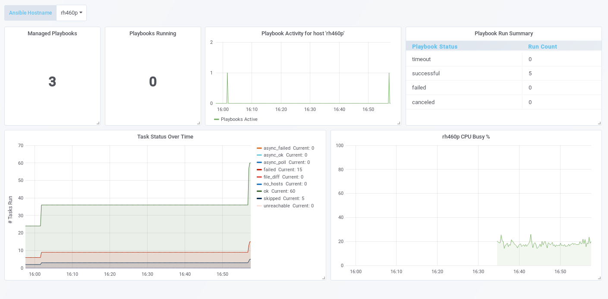

# Integrating with Prometheus and Grafana

## Scraping the data into Prometheus
The ansible-runner-service process uses https, so to there are a couple of additional options needed to get Prometheus to scrape the data.  

Here's an example (used during testing);  
```
- job_name: "ansible-runner-service"
  scrape_interval: 5s
  scheme: https
  tls_config:
    insecure_skip_verify: true
  static_configs:
    - targets: ["rh460p:5001"]

```

*obviously change the target!*

## Using a Dashboard
This directory has an example dashboard called ```ansible-runner-service-metrics.json``` which illustrates the kind of insights the
/metrics endpoint can provide. Import it into you grafana instance and you should see something like;  



The dashboard uses a template variable to represent the host so you could use the same dashboard to report against multiple instances of the ansible-runner-service. As you can see above, the dashboard also provides CPU busy information. To see this data, you need to have node_exporter (0.16 or above) installed too.
